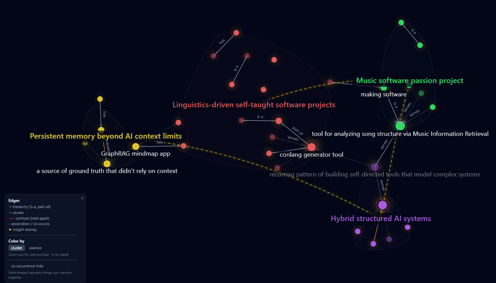
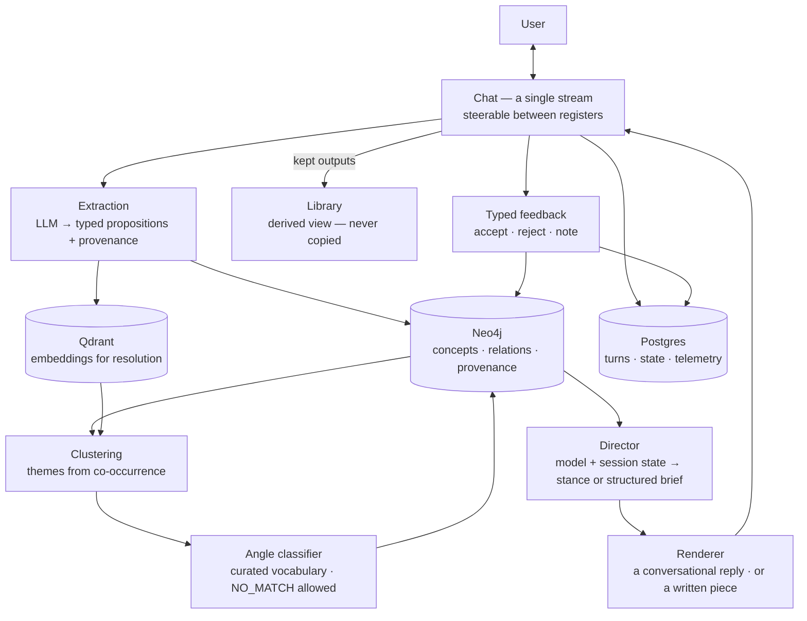
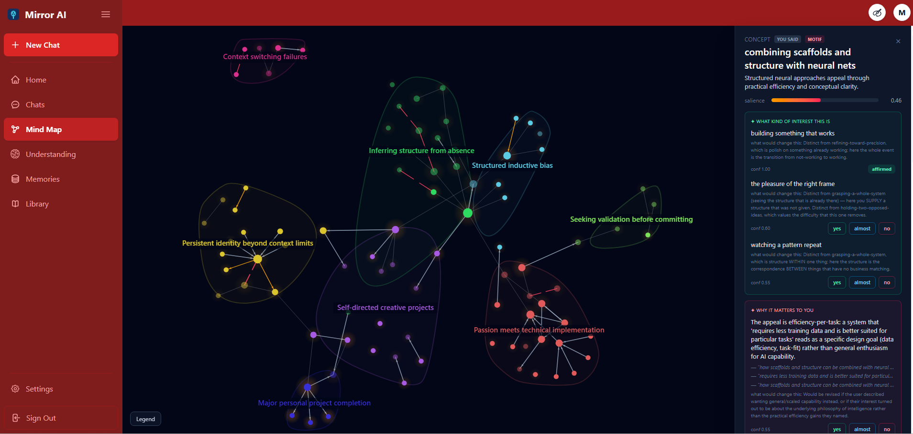
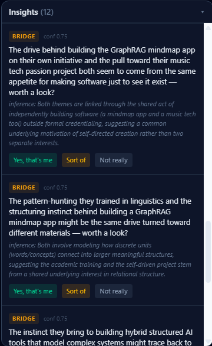

# Mirror

**A structured model of your thoughts.** Not just a chat log: a knowledge graph of recurring themes in your thinking, the angles you take on them, and what connects them. It gets more accurate the more you use it.

---

## The problem

LLM applications don't remember people. A context window isn't memory. It's a buffer that fills up, truncates, and forgets, so every "AI that knows you" product ends up re-reading a transcript and hoping the important parts are still in scope.

Mirror works the other way around. Instead of trying to retain the conversation, it builds a persistent structured graph model of the user: extracting concepts from what they say, resolving those into typed graph entities, clustering them into themes, and classifying why each theme keeps coming up. The conversation is just the input. The graph gets built out of it over time.

The app is one object seen from three sides: the map makes the model visible; the conversation is how it gets built and how it knows what to ask; and its longer written pieces are the graph model put to work, generating content shaped by what it knows, with every reaction flowing back in as signal. A CRM proves itself in the actions it drives; this proves itself in what it writes for and about the user.



*The map view. Nodes are concepts extracted from conversation; solid edges are typed relations (`is-a`, `part-of`, `serves`, `causes`); hulls are clusters; dashed lines are cross-cluster bridges that the engine proposed.*

---

## Architecture


**Chat is one stream that can be delivered in one of two registers.** Every turn gets routed either conversationally or generatively, and the user can steer between them. The director sits in front of replies in either register, and compiles your graph and the session state into a structured brief. In the conversational register it sets a stance (ask versus suggest, gated by how confident the model actually is). In the generative register it uses its brief to write longer prose responses highlighting its inferences about the user. Optionally, the director call can pass a brief to a second, cheaper renderer model for the reply itself, which is behind a flag in this build. 

**Why three stores?** Each one holds what it's good at. Neo4j contains the entities and the relationships between them, which is the model itself. Qdrant handles vector similarity for concept resolution and deduplication. Postgres holds conversation state, telemetry, user profiles, and anything that needs real constraints (the idempotency key is a single atomic upsert). Three stores means three things to run and keep in sync, which does add complexity. I accepted that cost rather than force a graph traversal into a relational schema or a similarity search into a graph.

---

## How it works

1. **Ingest.** A user message goes through an extraction pass that emits typed propositions rather than free text.
2. **Resolve.** Each concept gets embedded and matched against existing nodes, so near-duplicates merge instead of proliferating.
3. **Cluster.** Concepts that co-occur across conversations group into themes.
4. **Classify.** Each cluster is matched to one entry in a **curated "angle" vocabulary**, which is the claim about *why* that theme recurs for this user. The classifier picks from a fixed set or returns `NO_MATCH`. It can't create a new angle.
5. **Generate and learn.** The model conditions a generation brief, and the user's reactions (accept, reject, edit, correction notes) come back as signal. An accept reinforces the concepts that fed that generation; rejections and notes are recorded but deliberately kept out of the graph.

---

## Three tiers of inference 

The graph model is layered by how much interpretation each layer does, and each layer is held to a stricter evidence bar than the one below it. Tier 1 is what the user actually says: concepts named at the level of detail the user names them at, with no inference. Tier 2 is the angle, a claim about why a cluster of those concepts recurs or is especially relevant for the user, drawn from a fixed vocabulary. Tier 3 is the deepest read, naming where a pattern came from or what it does for the user, and waiting until it has grounding evidence rather than guessing.



*A concept selected in the map. The panel shows what the engine has attached to it: the angles under "what kind of interest this is," each with a confidence score and a note on what would change it, and one of the deeper reads under "why it matters to you" with the quotes it drew on. Further sections below cover where a pattern came from and what larger motifs it belongs to.*

---

## Notable engineering decisions

**The mind map model is the user's, and it's legible.** A system that builds a profile of someone should let them see it and change it. The graph is inspectable three ways: visually as a map, as a text list, and as a reviewable set of what's been learned — and any of it can be corrected or removed. The whole graph exports as JSON. None of this is a compliance feature bolted on; if someone can't change their model they won't trust it, and a model they can't correct will stay wrong.


**Constrained extraction over free generation.** The tier-2 classifier maps a cluster to one entry in a curated vocabulary, validated against a fixed set of keys, with `NO_MATCH` as a first-class result. An LLM asked to "describe the psychology here" will always produce something fluent, but if it's asked to choose from a list or abstain, it can be wrong in a detectable and auditable way. I wanted auditability more than breadth of explanation. The same discipline gates a third, deeper inference layer, which abstains rather than speculating when it has no grounding evidence.



*Insights are typed: `BRIDGE` across clusters, `ORIGIN` tracing a theme to an event, `FUNCTION` naming what a pattern does. Bridges are shown here. Each carries a confidence score, and exposes the reasoning behind it. Each takes a typed reaction that feeds back into the model.*

**The conversational layer is gated like the classifier.** The user builds the model by talking to Mirror, an interlocutor with deliberately narrow rules. It's honest about being an AI if asked. Its understanding shows up in what it asks rather than in analysis handed back to the user. It only suggests a direction when the model behind it is confident, and otherwise it asks. This is the same rule as before, "abstain rather than fluently invent something wrong", applied to conversation. Personas live in a swappable registry set by one env var instead of being baked into prompt text.

**Message Reactions:** for all model-generated messages, reception is logged. The user can accept or reject messages, with an optional note. These reactions are stored with the generation they belong to. Messages in the longer generative register include reaction chips that give the user suggested steering options for the next turn, such as "ground it in an example," or "explain more of your thinking."

**Staged generation:** a director/renderer split. With the split on, that brief becomes a handoff contract between two models: one compiles the user model and session state into it, a cheaper one executes. Session state lives in the brief rather than in the large model's context window, so continuity survives a model swap and the more expensive model generates fewer tokens per turn. This is the same idea as the memory layer, applied to generation: state lives in structure, not in context. This is behind a flag and off by default in this build.

**Multi-model routing by cost and capability.** Each turn makes several LLM calls beyond the reply itself, for extraction and angle classification. These are routed to a small model, while generation is routed to a larger one. Embeddings are handled by a dedicated model as well. Generation, extraction, and angle classification each read their model from an env var, so swapping one needs a restart. The embedding model is set in the config file instead and is coupled to its vector dimension, so changing it requires a re-embed and a new collection.

**Derived views over duplicated state.** Compiled views render from their source turns rather than being copied at save time. Copying would have been simpler on day one but a synchronization bug going forward.

**Evaluation as recovery scoring.** The system is designed to be measured against ground-truth cases. Given a subject whose actual structure is known, does the engine recover it, or confabulate something plausible? For a system that makes claims about people, confabulation rate matters more than fluency.

---

## Stack

**Backend:** Python, FastAPI, an async job queue and a background scheduler
**Stores:** Neo4j (graph), Qdrant (vectors), Postgres/Supabase (relational + auth)
**Frontend:** Next.js, React, TypeScript, D3-based graph visualization, responsive across the app with a dedicated mobile treatment for the graph
**Models:** LLM inference (extraction, classification, conversation, director, renderer) routed through OpenRouter with per-role model selection in config; the renderer role can optionally be pinned to a separate OpenAI-compatible provider. OpenAI embeddings
**Infra:** Docker Compose
**Tests:** 231 unit and integration tests

---

## Running locally

```bash
git clone <repo>
cd mirror_app

# Each component has its own .env.example — copy and fill in each one:
cp backend/.env.example backend/.env          # store credentials + LLM API keys + model routing
cp frontend/.env.example frontend/.env.local  # API URL, Supabase public keys
cp supabase/.env.example supabase/.env        # OAuth provider secrets

docker compose --env-file backend/.env up -d  # Neo4j + Qdrant (reads the Neo4j password)
supabase start                                # Postgres + auth (requires the Supabase CLI)
```

`docker compose` brings up Neo4j and Qdrant only. Postgres and auth come from Supabase, so the local stack needs the [Supabase CLI](https://supabase.com/docs/guides/cli) as well. The API keys the backend actually needs are documented in `backend/.env.example`.

---

## Production considerations

This is a single-user demo built to exercise an architecture, not a deployed service. Here's what the current build does and what would need to change to run it for real.

**Tenant isolation.** Identity comes from a JWT-derived dependency rather than from anything the client sends, and every store query scopes to it. Isolation is enforced in the application layer: the backend connects to Postgres as a service role, and neither Neo4j nor Qdrant has a row-level-security concept, so every query has to carry the user scope itself. The defense-in-depth version binds Postgres RLS to per-request JWT roles, and a cross-tenant test suite is the verification step I'd want before a second person ever had an account.

**Cost.** LLM inference is both the dominant cost and the dominant latency. Spend is bounded at the provider with a hard credit cap rather than in the application, which is the right control for one user, since a per-user budget enforces fairness across many users and doesn't lower the bill. The multi-user app would need both: admission control with per-user fairness so one heavy session can't starve the rest, and the provider ceiling behind it. The reductions I'd reach for first are caching the stable prompt prefix at the provider, since the system rules are identical on every turn; gating expensive calls behind cheap ones so extraction only runs on turns that plausibly carry new signal; and replacing LLM classification with vector retrieval where the task allows, since mapping a cluster to one entry in a fixed vocabulary is a nearest-neighbor problem and the embeddings already exist.

**Consistency across three stores.** Postgres, Neo4j, and Qdrant are written without a distributed transaction. The mitigation is structural rather than transactional: derived views instead of duplicated state, so a compiled view renders from its source turns and there's no second copy to fall out of sync. Where duplication is unavoidable, like a concept's vector in Qdrant alongside its node in Neo4j, reconciliation would be a periodic repair pass rather than a guarantee. At production scale this is the problem I'd expect to spend real time on.

**Privacy and data handling.** Deletion is cross-store and explicit, covering the user's rows in Postgres, their subgraph in Neo4j, and their vectors in Qdrant. Consent for retaining training data is snapshotted at write time rather than read live, so revoking it later can't retroactively license records already written. At-rest encryption belongs at the infrastructure layer, with encrypted volumes locally and managed-database encryption in any real deployment. Application-layer field encryption is the meaningful next step given the data category, since a structured model of someone's interior is closer to clinical notes than to application telemetry. It can't be applied uniformly, because the graph's value is querying it and encrypted fields can't be traversed or similarity-searched. The right scope is free-text disclosure, leaving the structural layer queryable, with key management and rotation as the cost.

**LLM-specific threats.** There are no specific defenses against prompt injection, because there's currently little for it to reach. A user can only influence their own graph, and there are no cross-user tools or agentic actions to hijack, so the potential damage is self-limited. That changes if ingestion ever accepts third-party content, since imported documents are someone else's words affecting the user's graph, and a quoted opinion could be read as the user's. Output validation and provenance-based trust weighting would have to be implemented first.

**Reliability.** Writes on the message path are idempotent and keyed on the user and a client-supplied message id, so a network retry replays the cached response instead of double-writing. Extraction runs on an async queue rather than in the request path. Failures surface as errors rather than being handled gracefully, and a production build would need fallback behavior for each dependency, particularly for an LLM provider timeout or rate-limit response where the right answer is a queued retry rather than a failed turn.

**What changes at scale:**

**~100 users.** Nothing architectural. Cost per active user and provider rate limits become the operational concern.

**~10k.** Connection pooling and read replicas on Postgres. Graph queries need index and traversal-depth attention. The extraction queue needs real worker scaling, and the embedding pipeline wants batching and a cache.

**~1M.** Sharding is the easy part, since no edges cross user boundaries and partitioning by user means no traversal spans a shard. The harder constraint is per-user graph size. Community detection currently pulls a user's subgraph into the application process and runs Louvain there, and cluster similarity is pairwise, so one long-tenured user's graph binds before user count does, and sharding doesn't help because it's one user's data. The fixes are incremental reclustering rather than full recomputation, moving community detection into the database, and pruning or summarizing cold regions of the graph.

No load testing has been done, so no throughput numbers are claimed here. Also absent: staging and production separation, CI, audit logging, per-store backup and disaster recovery, and dependency vulnerability scanning. Each one matters for a deployed service, but none of them are within the scope of what a single-user demo needs to prove.

---

## Status and current limitations

This is a working v1 built solo, and it's worth being honest about where it currently stands.

- **Tier-2 angles were tautological on sparse graphs.** Early on, angles tended to restate the theme they described rather than explaining it. A thin cluster doesn't give the classifier anything but its own label to characterize. This improved as graphs became denser and clusters had more material behind them. I've observed the improvement rather than measured it, which is what the evaluation harness below is for. The deeper fix is a curated set of tier-1 types that extraction classifies *into*, rather than generating freely. That design is in progress.
- **The evaluation harness is specified, not implemented.** The recovery-scoring methodology above is a design, not a running test suite.
- **Generation output is untuned.** The loop is complete end to end (brief, render, typed feedback), but prose quality has had no tuning pass, and the staged director/renderer pipeline sits behind a feature flag rather than running by default.
- **Regeneration keeps only the latest take.** You can redo a piece with direction, but there's no UI yet to page between takes and pick one. The backend groups takes and archives the priors; the picker isn't built, so the newest replaces the previous one. 
- **The Library tab is thin.** It compiles a conversation's kept turns into one view, and since everything is kept by default, right now that's little more than pinned chats. It earns its place once take-picking and per-piece saving exist.

These are tuning and scope gaps rather than architectural ones, which is roughly what you'd expect from a project where the design work outran the implementation time available.

---

*Source published for review; all rights reserved.*

*Implementation was AI-assisted; I owned the architecture and system design.*
